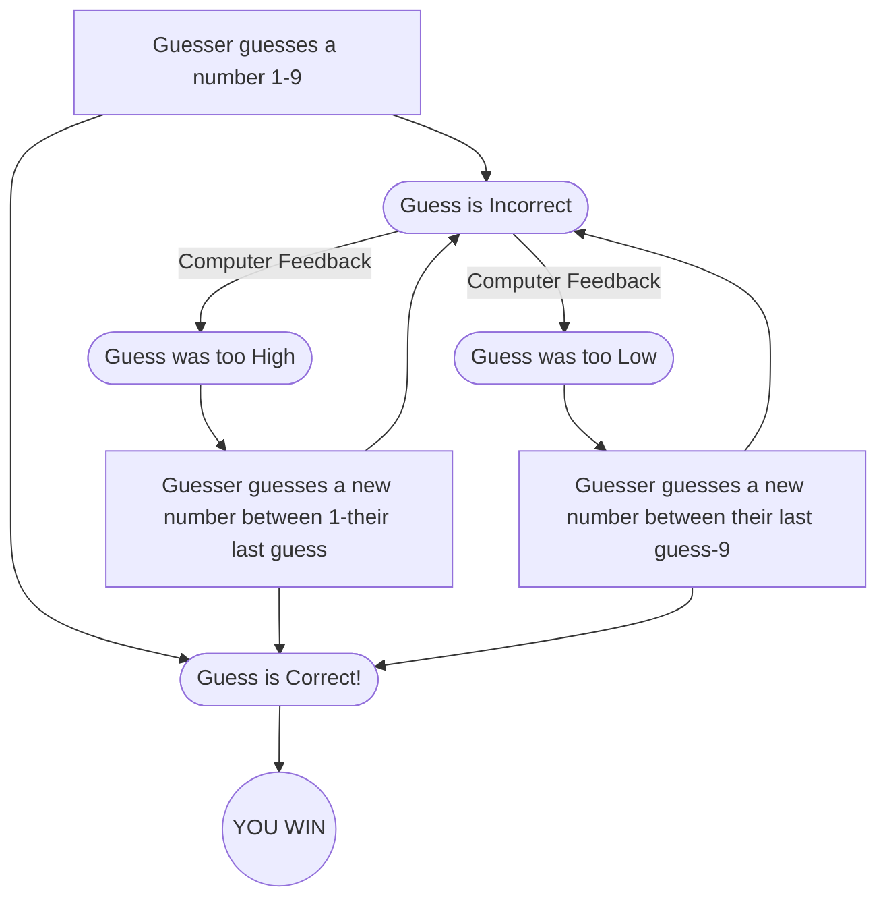

# Guessing Game Flowchart

### Description of Steps
A random number is generated by the computer. The guesser guesses a number between 1 and 9. The computer then tells the guesser they are correct or incorrect in guessing the randomly generated number.  

If the guesser guessed too high, the guesser will then guess a number between 1 and their previous guess. The computer will then tell the guesser if they are correct or incorrect.  

If the guesser guessed too low, the guesser will then guess a number between their previous guess and 9. The computer will then tell the guesser if they are correct or incorrect. 

This process of guessing lower or higher than the guesser's previous guess will continue until the correct number is guessed and the guesser wins!
